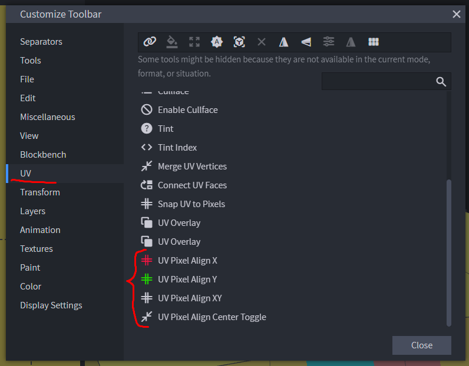
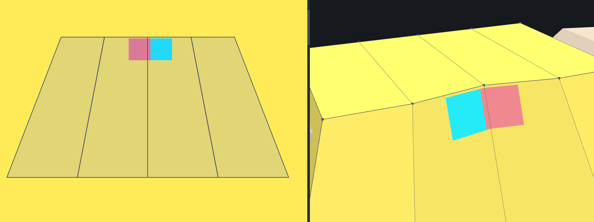
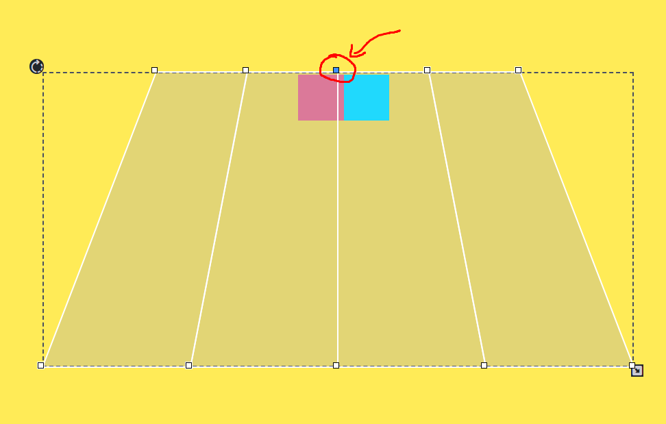
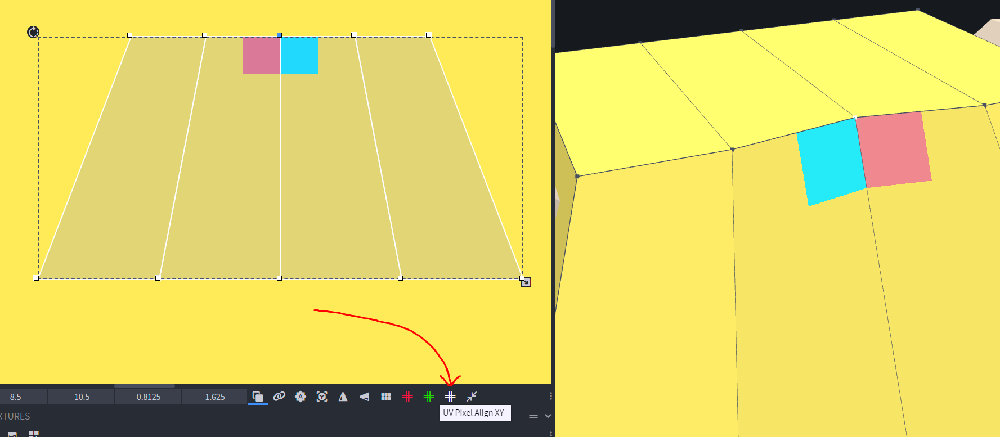
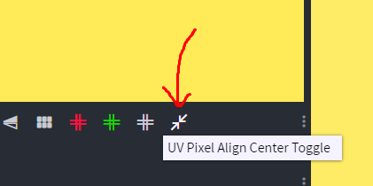
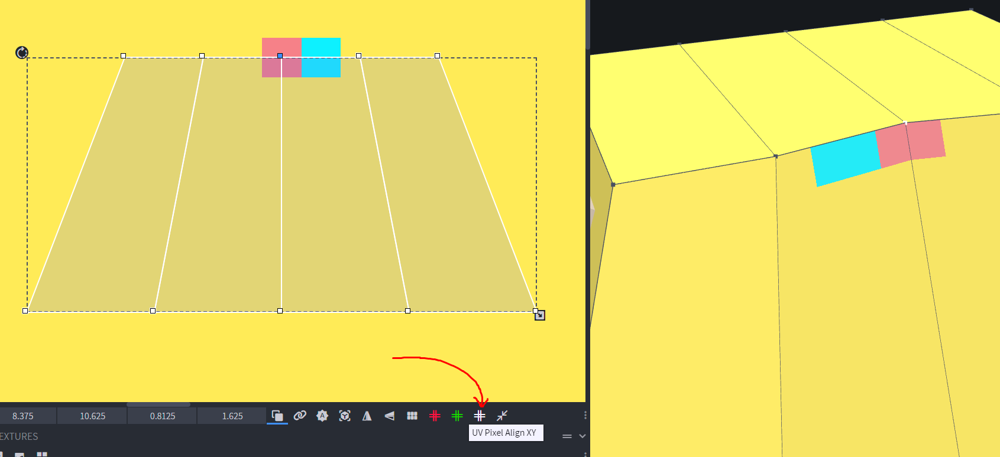
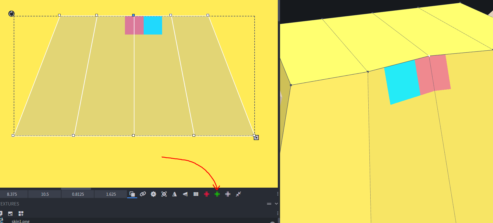

# Blockbench UV Pixel Align
 
This plugin allows you to align multiple selected faces in the UV editor to the pixel grid, by using a vertex (or multiple) as the anchor. When a vertex is aligned, all selected faces will move along with it.

#### Usage
- Download plugin file [uv_pixel_align.js](uv_pixel_align.js "download") and install
- Open UV Editor and customize the toolbar by adding the buttons this plugin adds  

***
### In this example I want to align these faces to the two pixels

***
### First select all the faces you want to align, then select a vertex which will be used as the anchor for snapping to grid 

***
### With the vertex selected, click the "UV Pixel Align XY" button. This will snap the vertex to the nearest pixel and move all the selected faces with it. Optionally, this plugin also provides buttons to individually align on the X or Y axis. (red button for X alignment, green for Y)

***
### If you want the vertex to snap to the center of a pixel, click the "UV Pixel Align Center Toggle" button. This will enable center snapping. When you want to disable it, click it again.

***
### Now when I click "UV Pixel Align XY", the vertex is aligned to the center of a pixel. If it snaps to the wrong pixel, move the selected faces to position the anchor vertex over the pixel you want it to snap too and press the button again. (Make sure the anchor vertex is still selected)

***
### Now, I want to keep it aligned to the center on the X axis, but for the Y axis to be aligned to the grid. I clicked the "UV Pixel Align Center Toggle" to disable center snapping, then clicked the "UV Pixel Align Y" to snap along only the Y axis.

***
### Note: When moving faces manually, selected vertices gets deselected. If the align buttons aren't doing anything, make sure a vertex is selected.
### Note: When multiple vertices are selected, the anchor will be the average of their position.
### Note: On Cube objects, you cant select a vertex in the UV editor, so just select the face and it will use the top left vertex as the anchor.

